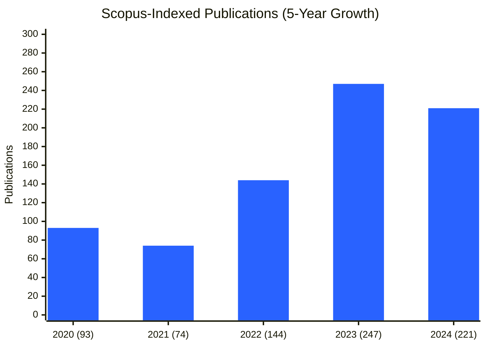

# University of Dubai Research
### Local Roots. Global Reach.

 

**Pioneering the future of AI, Smart Cities, and Sustainable Development in the heart of the UAE.**

---

## 🏛️ About Us
The **University of Dubai Research** organization is the central hub for open-science initiatives, datasets, and code repositories driven by our faculty and research fellows. We bridge the gap between academic theory and practical impact, focusing on solutions that serve Dubai's vision for a smart, sustainable future.

## 🔬 Research Leadership & Principal Investigators

We are driven by a distinguished team of researchers advancing the frontiers of science and technology.

| Name | Role / Project Focus | Researcher Profile |
| :--- | :--- | :--- |
| **Dr. Husameldin Mukhtar** | Director of Research |  |
| **Prof. Hussain Al-Ahmad** | Provost / Chief Academic Officer |  |
| **Dr. Nasser Al Muraqab** | Smart Logistics & Aerial Systems |  |
| **Dr. Husameldin Mukhtar** | AI & Wireless Security |  |
| **Dr. Nour Aburaed** | Generative AI in Healthcare |  |
| **Dr. Mohammed Rababa** | Legal Tech & AI Policy |  |
| **Prof. Washika Saheem** | Strategic Workforce Mobility |  |
| **Dr. Christine Markarian** | Urban Systems & Algorithms |  |

---

## 🚀 2026 Strategic Research Initiatives
We are proud to announce our core research tracks for the 2026 cycle, funded by the **UD Internal Research Fund (UD-IRF)**.

### 🏙️ Track 1: Smart Cities & Urban Connectivity
*Developing the neural network of the future city.*
* **Smart Aerial Logistics:** Urban delivery drones & EMS solutions for congested cities.
* **Invisible Connectivity:** Transparent antennas for next-gen smart city infrastructure.
* **Dubai’s Emotional Twin:** Algorithmic foundations for emotion-driven urban systems.
* **Workforce Mobility:** Strategic launchpad jobs and mobility in the UAE.

### 🤖 Track 2: Artificial Intelligence & Society
*Ensuring AI serves humanity with integrity and precision.*
* **Generative MRI:** AI-accelerated reconstruction for patient-centered imaging.
* **Academic Integrity:** Automated surveillance and cheating detection systems.
* **Fashion Tech:** AI-driven 3D body fitting and measurement transformation.
* **Wireless Security:** AI-assisted jamming detection in MIMO-OFDM systems.

### ⚖️ Track 3: Legal Tech & Governance
*Navigating the intersection of law and technology.*
* **UAE Arabic Legal Text Corpus:** Open-source datasets for Arabic Legal NLP.
* **Synthetic Creativity:** Copyright implications in the age of Generative AI.

### 🌱 Track 4: Sustainability & Economics
*Modeling a resilient future.*
* **Sustainable Farming:** AI-powered remote sensing for agriculture.
* **Energy Transition:** Economic impact modeling on resilient UAE industries.

---

## 🌟 Featured Open Source Projects

| Project | Description | Tech Stack |
| :--- | :--- | :--- |
| **[UAE Arabic Legal Text Corpus](https://github.com/University-of-Dubai-Research/arabic-legal-text)** | A curated, machine-readable corpus of UAE laws for NLP & AI training. | `NLP` `JSONL` `Law` |

---

---

## 📈 Research Impact at a Glance

Our commitment to academic excellence is reflected in the exponential growth of our Scopus-indexed publications.

## 📑 Publication Archive

Explore our peer-reviewed journals and articles by year:

| Year | Volume | Link |
|------|--------|------|
| **2024** | 221 Publications | 📂 [View List](https://research.ud.ac.ae/2024-publications/) |
| **2023** | 247 Publications | 📂 [View List](https://research.ud.ac.ae/2023-publications/) |
| **2022** | 144 Publications | 📂 [View List](https://research.ud.ac.ae/2022-publications/) |
| **2021** | 74 Publications | 📂 [View List](https://research.ud.ac.ae/2021-publications/) |
| **2020** | 93 Publications | 📂 [View List](https://research.ud.ac.ae/2020-publications/) |

## 💡 Patents & Intellectual Property
Our faculty are pioneering inventors, securing US and International patents in critical technology sectors.

| Patent Title | Inventor(s) | Patent Number |
| :--- | :--- | :--- |
| **Secured & Robust Wireless Communication System** *(Low-latency applications for Smart Cities)* | **Dr. Husameldin Mukhtar**, A. Al-Dweik, et al. |  |
| **Transmitting Symbols via Unipolar Signals** *(Advanced Optical Communications)* | **Dr. Diana Dawoud** |  |
| **High Efficiency Step Photovoltaic Cells** *(Low-cost Solar Energy Solution)* | **Dr. Sabina Abdul Hadi** |  |

---

## 🤝 Collaborate with Us
We welcome collaboration from global researchers, industry partners, and government entities.

* **For Faculty:** Please adhere to our [Contribution Guidelines](https://github.com/University-of-Dubai-Research/arabic-legal-text/blob/main/CONTRIBUTING.md) when publishing data.
* **Contact:** research@ud.ac.ae

© 2026 University of Dubai. All Rights Reserved.

